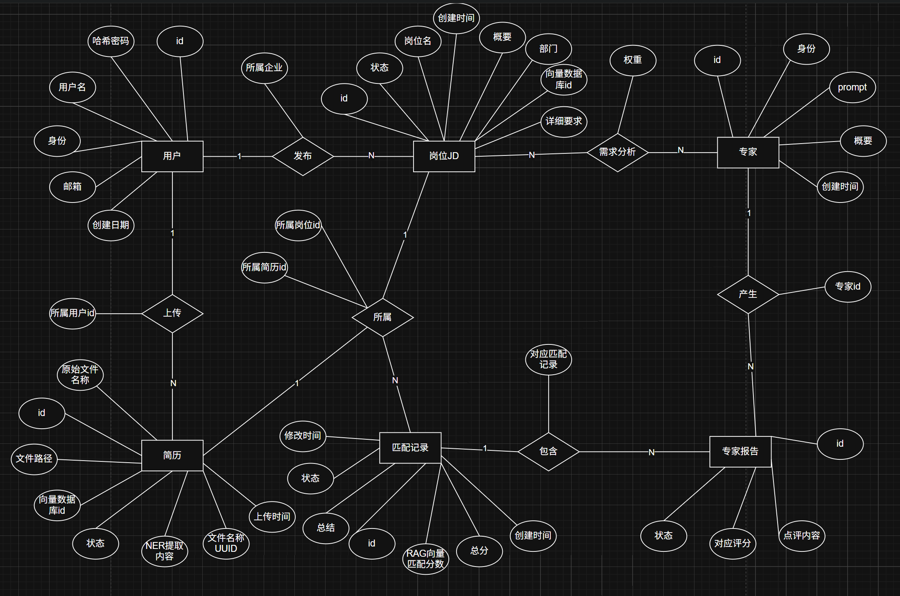

# 数据库设计

## 一、ER 图



## 二、数据库设计

本系统使用MySQL作为关系型数据库，数据库名为`resume_gpt`，采用utf8mb4字符集以支持完整的Unicode字符，包括emoji表情等。数据库设计共包含7个核心表，用于支持用户管理、简历上传与解析、岗位JD管理、专家Agent配置以及简历与岗位的匹配评估流程。

### 2.1 数据库概览

| 表名               | 中文名称       | 主要功能                                 |
| ------------------ | -------------- | ---------------------------------------- |
| users              | 用户表         | 存储系统用户信息，区分企业HR和普通求职者 |
| resumes            | 简历表         | 存储用户上传的简历文件及其解析结果       |
| job_descriptions   | 岗位JD表       | 存储企业发布的岗位描述信息               |
| experts            | 专家设定表     | 存储系统中定义的各类专家Agent信息        |
| jd_expert_configs  | JD-专家配置表  | 存储岗位与专家的关联关系及权重配置       |
| match_records      | 匹配记录表     | 存储简历与岗位的匹配评估全生命周期信息   |
| expert_evaluations | 专家评估明细表 | 存储每个专家Agent对简历的具体评估结果    |

### 2.2 表结构设计

#### 2.2.1 用户表 (users)

用户表用于存储系统中的所有用户信息，通过role字段区分企业HR和普通求职者。

| 字段名          | 类型         | 约束                                | 说明                                     |
| --------------- | ------------ | ----------------------------------- | ---------------------------------------- |
| id              | INT          | PRIMARY KEY, AUTO_INCREMENT         | 用户唯一标识                             |
| username        | VARCHAR(50)  | NOT NULL, UNIQUE                    | 用户名，登录凭证之一                     |
| email           | VARCHAR(100) | NOT NULL, UNIQUE                    | 邮箱，登录凭证之一                       |
| hashed_password | VARCHAR(255) | NOT NULL                            | 加密后的密码                             |
| role            | VARCHAR(20)  | NOT NULL, DEFAULT 'user'            | 用户角色: user(普通用户) / admin(管理员) |
| created_at      | DATETIME     | NOT NULL, DEFAULT CURRENT_TIMESTAMP | 账户创建时间                             |

**索引设计**:

- idx_username: 加速基于用户名的查询
- idx_email: 加速基于邮箱的查询
- idx_role: 加速基于角色的过滤查询

#### 2.2.2 简历表 (resumes)

简历表存储用户上传的简历文件信息，以及NER模型提取的结构化数据和向量数据库的映射关系。

| 字段名             | 类型         | 约束                                | 说明                                                                  |
| ------------------ | ------------ | ----------------------------------- | --------------------------------------------------------------------- |
| id                 | INT          | PRIMARY KEY, AUTO_INCREMENT         | 简历唯一标识                                                          |
| user_id            | INT          | NOT NULL, FOREIGN KEY               | 关联的用户ID                                                          |
| filename           | VARCHAR(255) | NOT NULL                            | 存储文件名(UUID)                                                      |
| original_filename  | VARCHAR(255) | NOT NULL                            | 原始文件名                                                            |
| file_path          | VARCHAR(500) | NOT NULL                            | 文件存储路径                                                          |
| file_type          | VARCHAR(20)  | NOT NULL                            | 文件类型(pdf/docx等)                                                  |
| status             | VARCHAR(20)  | NOT NULL, DEFAULT 'pending'         | 解析状态: pending(待处理)/parsing(解析中)/parsed(已解析)/failed(失败) |
| ner_extracted_data | JSON         | NULL                                | NER模型提取的关键信息(结构化JSON，如技能、学历、年限)                 |
| vector_id          | VARCHAR(100) | NULL                                | 对应向量数据库中的ID                                                  |
| uploaded_at        | DATETIME     | NOT NULL, DEFAULT CURRENT_TIMESTAMP | 简历上传时间                                                          |

**索引设计**:

- idx_user_id: 加速基于用户的简历查询
- 外键约束: user_id关联users表，级联删除

#### 2.2.3 岗位JD表 (job_descriptions)

岗位JD表存储企业发布的岗位描述信息，用于与简历进行匹配。

| 字段名        | 类型         | 约束                                | 说明                              |
| ------------- | ------------ | ----------------------------------- | --------------------------------- |
| id            | INT          | PRIMARY KEY, AUTO_INCREMENT         | 岗位JD唯一标识                    |
| enterprise_id | INT          | NOT NULL, FOREIGN KEY               | 发布JD的企业用户ID                |
| title         | VARCHAR(100) | NOT NULL                            | 岗位名称                          |
| department    | VARCHAR(100) | NULL                                | 所属部门                          |
| description   | TEXT         | NOT NULL                            | 岗位描述与要求摘要                |
| vector_id     | VARCHAR(100) | NULL                                | JD在向量数据库中的ID，用于粗匹配  |
| status        | VARCHAR(20)  | NOT NULL, DEFAULT 'open'            | 状态: open(开放中)/closed(已关闭) |
| created_at    | DATETIME     | NOT NULL, DEFAULT CURRENT_TIMESTAMP | JD创建时间                        |

**索引设计**:

- idx_enterprise: 加速基于企业的岗位查询
- 外键约束: enterprise_id关联users表，级联删除

#### 2.2.4 专家设定表 (experts)

专家设定表存储系统中定义的各类专家Agent信息，每个专家有特定的领域专长和系统提示词。

| 字段名        | 类型         | 约束                                | 说明                               |
| ------------- | ------------ | ----------------------------------- | ---------------------------------- |
| id            | INT          | PRIMARY KEY, AUTO_INCREMENT         | 专家唯一标识                       |
| name          | VARCHAR(50)  | NOT NULL                            | 专家名称(如: Java技术专家, HR政委) |
| description   | VARCHAR(255) | NULL                                | 专家侧重领域的描述                 |
| system_prompt | TEXT         | NOT NULL                            | 该专家专属的System Prompt          |
| created_at    | DATETIME     | NOT NULL, DEFAULT CURRENT_TIMESTAMP | 专家创建时间                       |

#### 2.2.5 JD-专家配置表 (jd_expert_configs)

JD-专家配置表实现MoE(Mixture of Experts)路由配置，定义每个岗位需要哪些专家参与评估及其权重。

| 字段名    | 类型         | 约束                     | 说明                                              |
| --------- | ------------ | ------------------------ | ------------------------------------------------- |
| jd_id     | INT          | NOT NULL, FOREIGN KEY    | 关联的岗位JD ID                                   |
| expert_id | INT          | NOT NULL, FOREIGN KEY    | 关联的专家ID                                      |
| weight    | DECIMAL(5,4) | NOT NULL, DEFAULT 1.0000 | 该专家在此JD评估中的权重占比 (如 0.4000 表示 40%) |

**索引设计**:

- PRIMARY KEY: (jd_id, expert_id) 联合主键
- 外键约束: jd_id关联job_descriptions表，expert_id关联experts表，级联删除

#### 2.2.6 匹配记录表 (match_records)

匹配记录表是系统的核心表，记录简历投递与评估的全生命周期，从粗匹配到专家评估再到最终结果。

| 字段名                | 类型        | 约束                                                            | 说明                                                                                         |
| --------------------- | ----------- | --------------------------------------------------------------- | -------------------------------------------------------------------------------------------- |
| id                    | INT         | PRIMARY KEY, AUTO_INCREMENT                                     | 匹配记录唯一标识                                                                             |
| jd_id                 | INT         | NOT NULL, FOREIGN KEY                                           | 关联的岗位JD ID                                                                              |
| resume_id             | INT         | NOT NULL, FOREIGN KEY                                           | 关联的简历ID                                                                                 |
| workflow_status       | VARCHAR(30) | NOT NULL, DEFAULT 'rough_matching'                              | 状态: rough_matching(粗排中) / agent_evaluating(专家评估中) / completed(完成) / failed(失败) |
| vector_similarity     | FLOAT       | NULL                                                            | 向量粗匹配的语义相似度得分                                                                   |
| final_score           | FLOAT       | NULL                                                            | 多专家加权计算后的最终总分                                                                   |
| comprehensive_summary | TEXT        | NULL                                                            | 最终由综合专家(C专家)给出的整体总结报告                                                      |
| ability_summary       | JSON        | NULL                                                            | 用于显示能力雷达图的总结报告                                                                 |
| created_at            | DATETIME    | NOT NULL, DEFAULT CURRENT_TIMESTAMP                             | 记录创建时间                                                                                 |
| updated_at            | DATETIME    | NOT NULL, DEFAULT CURRENT_TIMESTAMP ON UPDATE CURRENT_TIMESTAMP | 记录更新时间                                                                                 |

**索引设计**:

- uk_jd_resume: (jd_id, resume_id) 唯一索引，防止同一份简历重复投递/匹配同一个JD
- 外键约束: jd_id关联job_descriptions表，resume_id关联resumes表，级联删除

#### 2.2.7 专家评估明细表 (expert_evaluations)

专家评估明细表记录每个专家Agent对特定简历的评估结果，包括评分和分析内容。

| 字段名           | 类型        | 约束                                | 说明                                                             |
| ---------------- | ----------- | ----------------------------------- | ---------------------------------------------------------------- |
| id               | INT         | PRIMARY KEY, AUTO_INCREMENT         | 评估记录唯一标识                                                 |
| match_record_id  | INT         | NOT NULL, FOREIGN KEY               | 关联的匹配记录ID                                                 |
| expert_id        | INT         | NOT NULL, FOREIGN KEY               | 关联的专家ID                                                     |
| agent_status     | VARCHAR(20) | NOT NULL, DEFAULT 'processing'      | 单个Agent状态: processing(处理中) / success(成功) / failed(失败) |
| score            | FLOAT       | NULL                                | 该专家给出的单项原始评分 (例如0-100分)                           |
| analysis_content | TEXT        | NULL                                | 该专家输出的详细点评与分析理由                                   |
| created_at       | DATETIME    | NOT NULL, DEFAULT CURRENT_TIMESTAMP | 评估创建时间                                                     |

**索引设计**:

- uk_match_expert: (match_record_id, expert_id) 唯一索引，一次匹配中一个专家只出具一份报告
- 外键约束: match_record_id关联match_records表，expert_id关联experts表，级联删除

### 2.3 数据库关系说明

1. **用户与简历关系**: 一个用户可以上传多份简历，通过users.id与resumes.user_id建立一对多关系。

2. **用户与岗位JD关系**: 一个企业用户可以发布多个岗位JD，通过users.id与job_descriptions.enterprise_id建立一对多关系。

3. **岗位与专家关系**: 一个岗位JD可以配置多个专家参与评估，每个专家在不同岗位中有不同的权重，通过job_descriptions.id与jd_expert_configs.jd_id建立一对多关系。

4. **简历与岗位匹配关系**: 一份简历可以投递多个岗位，一个岗位也可以接收多份简历，通过match_records表建立多对多关系，并通过唯一索引uk_jd_resume防止重复匹配。

5. **匹配记录与专家评估关系**: 一个匹配记录可以包含多个专家的评估结果，通过match_records.id与expert_evaluations.match_record_id建立一对多关系。

### 2.4 数据库初始化脚本

```sql
CREATE DATABASE IF NOT EXISTS resume_gpt
DEFAULT CHARACTER SET utf8mb4
DEFAULT COLLATE utf8mb4_unicode_ci;

USE resume_gpt;

-- 1. 用户表 (区分企业HR和普通求职者)
CREATE TABLE IF NOT EXISTS users (
    id INT AUTO_INCREMENT PRIMARY KEY,
    username VARCHAR(50) NOT NULL UNIQUE,
    email VARCHAR(100) NOT NULL UNIQUE,
    hashed_password VARCHAR(255) NOT NULL,
    role VARCHAR(20) NOT NULL DEFAULT 'user' COMMENT '角色: user / admin',
    created_at DATETIME NOT NULL DEFAULT CURRENT_TIMESTAMP,
    INDEX idx_username (username),
    INDEX idx_email (email),
    INDEX idx_role (role)
) ENGINE=InnoDB DEFAULT CHARSET=utf8mb4 COLLATE=utf8mb4_unicode_ci;

-- 2. 简历表 (新增NER提取结果和向量数据库映射)
CREATE TABLE IF NOT EXISTS resumes (
    id INT AUTO_INCREMENT PRIMARY KEY,
    user_id INT NOT NULL,
    filename VARCHAR(255) NOT NULL COMMENT '存储文件名(UUID)',
    original_filename VARCHAR(255) NOT NULL COMMENT '原始文件名',
    file_path VARCHAR(500) NOT NULL COMMENT '文件存储路径',
    file_type VARCHAR(20) NOT NULL COMMENT '文件类型(pdf/docx等)',
    status VARCHAR(20) NOT NULL DEFAULT 'pending' COMMENT '解析状态: pending/parsing/parsed/failed',
    ner_extracted_data JSON NULL COMMENT 'NER模型提取的关键信息(结构化JSON，如技能、学历、年限)',
    vector_id VARCHAR(100) NULL COMMENT '对应向量数据库中的ID',
    uploaded_at DATETIME NOT NULL DEFAULT CURRENT_TIMESTAMP,
    FOREIGN KEY (user_id) REFERENCES users(id) ON DELETE CASCADE,
    INDEX idx_user_id (user_id)
) ENGINE=InnoDB DEFAULT CHARSET=utf8mb4 COLLATE=utf8mb4_unicode_ci;

-- 3. 岗位 JD 表
CREATE TABLE IF NOT EXISTS job_descriptions (
    id INT AUTO_INCREMENT PRIMARY KEY,
    enterprise_id INT NOT NULL COMMENT '发布JD的企业用户ID',
    title VARCHAR(100) NOT NULL COMMENT '岗位名称',
    department VARCHAR(100) NULL COMMENT '所属部门',
    description TEXT NOT NULL COMMENT '岗位描述与要求摘要',
    vector_id VARCHAR(100) NULL COMMENT 'JD在向量数据库中的ID，用于粗匹配',
    status VARCHAR(20) NOT NULL DEFAULT 'open' COMMENT '状态: open/closed',
    created_at DATETIME NOT NULL DEFAULT CURRENT_TIMESTAMP,
    FOREIGN KEY (enterprise_id) REFERENCES users(id) ON DELETE CASCADE,
    INDEX idx_enterprise (enterprise_id)
) ENGINE=InnoDB DEFAULT CHARSET=utf8mb4 COLLATE=utf8mb4_unicode_ci;

-- 4. 专家 / Agent 设定表
CREATE TABLE IF NOT EXISTS experts (
    id INT AUTO_INCREMENT PRIMARY KEY,
    name VARCHAR(50) NOT NULL COMMENT '专家名称(如: Java技术专家, HR政委)',
    description VARCHAR(255) NULL COMMENT '专家侧重领域的描述',
    system_prompt TEXT NOT NULL COMMENT '该专家专属的 System Prompt',
    created_at DATETIME NOT NULL DEFAULT CURRENT_TIMESTAMP
) ENGINE=InnoDB DEFAULT CHARSET=utf8mb4 COLLATE=utf8mb4_unicode_ci;

-- 5. JD - 专家路由与权重配置表 (MoE路由配置)
CREATE TABLE IF NOT EXISTS jd_expert_configs (
    jd_id INT NOT NULL,
    expert_id INT NOT NULL,
    weight DECIMAL(5,4) NOT NULL DEFAULT 1.0000 COMMENT '该专家在此JD评估中的权重占比 (如 0.4000 表示 40%)',
    PRIMARY KEY (jd_id, expert_id),
    FOREIGN KEY (jd_id) REFERENCES job_descriptions(id) ON DELETE CASCADE,
    FOREIGN KEY (expert_id) REFERENCES experts(id) ON DELETE CASCADE
) ENGINE=InnoDB DEFAULT CHARSET=utf8mb4 COLLATE=utf8mb4_unicode_ci;

-- 6. 核心：匹配记录表 (简历投递 & 评估全生命周期)
CREATE TABLE IF NOT EXISTS match_records (
    id INT AUTO_INCREMENT PRIMARY KEY,
    jd_id INT NOT NULL,
    resume_id INT NOT NULL,
    workflow_status VARCHAR(30) NOT NULL DEFAULT 'rough_matching' COMMENT '状态: rough_matching(粗排中) / agent_evaluating(专家评估中) / completed(完成) / failed',
    vector_similarity FLOAT NULL COMMENT '向量粗匹配的语义相似度得分',
    final_score FLOAT NULL COMMENT '多专家加权计算后的最终总分',
    comprehensive_summary TEXT NULL COMMENT '最终由综合专家(C专家)给出的整体总结报告',
    created_at DATETIME NOT NULL DEFAULT CURRENT_TIMESTAMP,
    updated_at DATETIME NOT NULL DEFAULT CURRENT_TIMESTAMP ON UPDATE CURRENT_TIMESTAMP,
    UNIQUE KEY uk_jd_resume (jd_id, resume_id), -- 防止同一份简历重复投递/匹配同一个JD
    FOREIGN KEY (jd_id) REFERENCES job_descriptions(id) ON DELETE CASCADE,
    FOREIGN KEY (resume_id) REFERENCES resumes(id) ON DELETE CASCADE
) ENGINE=InnoDB DEFAULT CHARSET=utf8mb4 COLLATE=utf8mb4_unicode_ci;

-- 7. 专家评估明细表 (记录每个Agent的输出)
CREATE TABLE IF NOT EXISTS expert_evaluations (
    id INT AUTO_INCREMENT PRIMARY KEY,
    match_record_id INT NOT NULL,
    expert_id INT NOT NULL,
    agent_status VARCHAR(20) NOT NULL DEFAULT 'processing' COMMENT '单个Agent状态: processing / success / failed',
    score FLOAT NULL COMMENT '该专家给出的单项原始评分 (例如0-100分)',
    analysis_content TEXT NULL COMMENT '该专家输出的详细点评与分析理由',
    created_at DATETIME NOT NULL DEFAULT CURRENT_TIMESTAMP,
    FOREIGN KEY (match_record_id) REFERENCES match_records(id) ON DELETE CASCADE,
    FOREIGN KEY (expert_id) REFERENCES experts(id) ON DELETE CASCADE,
    UNIQUE KEY uk_match_expert (match_record_id, expert_id) -- 一次匹配中，一个专家只出具一份报告
) ENGINE=InnoDB DEFAULT CHARSET=utf8mb4 COLLATE=utf8mb4_unicode_ci;
```
